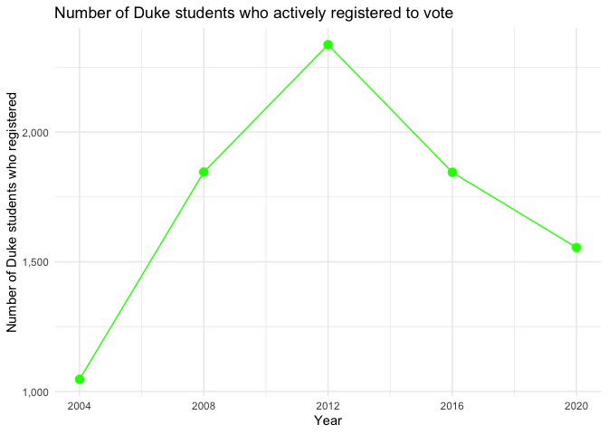

Final Memo
================
Margaret Reed
4/15/2022

### Intro

Many of the ‘bluest’ cities and towns in America house a variety of
universities and colleges. We began our data analysis investigation
interested in investigating the impact Duke and other university
students have on the elections of Durham and North Carolina. After
parsing and exploring the data, we came away with a couple of questions
to further pursue. How have NC Duke student registration numbers changed
over time? How does this compare with the number of Dukes students who
ended up voting in North Carolina? Likewise, we were also interested in
looking into how political party affiliations and voting habits have
changed over time.

### Methodology

To begin, we needed data. We ended up using NC voter registration data
and NC voter history data. However, nowhere in our data sets was there a
column for Duke Student: Y/N. Therefore, we needed to find some sort of
heuristic to approximate what constitutes a Duke student using the data
we had available. After some trial and error, we ended up classifying
Duke students as those whose mailing addresses were located on Duke’s
campus. The specific methodology is as follows:

  - The mailing address must specify a voter lives in a dorm named:
    “Bassett”, “Epworth”, “Few Quad”, “Gilbert Addoms”, “Giles”,
    “Jarvis”, “Maxwell”, “Mirecourt”, “Pegram”, “Randolph”, “Randolph
    Hall”, “Round Table”, “Southgate”, “Wayne Manor”, “Wilson”, or
    “Wannamaker”.

  - Otherwise, the street name must be one of the following: “Duke
    University West Campus”, “Duke University East Campus”, “Towerview”,
    “Alexander”, or “Yearby”.

  - Finally, we also looked at two special cases: Duke-owned apartment
    300 Swift, and the few outliers that were located on Campus Drive.

All of these decisions were driven by an exploration of the data and
looking at where high numbers of young people were concentrated near
Duke’s campus. Because our analysis only looks at registered voters in
Durham county, NC- we are not considering any of the students who may
have decided to vote in their home county or state. After classifying
who the Duke students were (within our methodology), we were ready to
begin our analysis.

``` r
election_year <- full_data %>%
  filter(
    str_detect(election_desc, "GENERAL"),
    voted_year %in% c(2004, 2008, 2012, 2016, 2020)
    ) %>%
  select(voter_reg_num, voted_year) %>%
  distinct() %>%
  count(voted_year)
  

election_yr_reg <- duke_students %>%
  mutate(cancel_yr = lubridate::year(cancellation_dt)) %>%
  mutate(
    cancel_yr = ifelse(cancel_yr == 1900, 2023, cancel_yr)
  ) %>%
  transmute(voter_reg_num, year = map2(registr_yr, cancel_yr, seq, by = 1)) %>%
  unnest(cols = c(year)) %>%
  filter(year %in% c(2004, 2008, 2012, 2016, 2020)) %>%
  select(voter_reg_num, year) %>%
  distinct() %>%
  count(year)

newly_reg <- duke_students %>%
  filter(registr_yr %in% c(2004, 2008, 2012, 2016, 2020)) %>%
  select(voter_reg_num, registr_yr) %>%
  distinct() %>%
  count(registr_yr)
```

### Analysis

First we look into how many duke students actively registered to vote
during presidential election years.

<!-- -->

Interestingly, it seems as if Duke students were the most motivated to
registered to vote in the 2012 election. It would be interesting to
investigate further whether this is actually true- and dig into why, or
if this can be attributed to the methodology capturing the most duke
students during 2012.

Next we looked at how many Duke students were registered to vote-
whether that be because they actively registered or because a previous
voter registration carried over.

<!-- -->

Next we looked at Duke students who actually voted in presidential
election years.

<!-- -->

Here we compared our three data sets:

<!-- -->

Interestingly, while the number of Duke students who were registered to
vote in Durham, NC increased each election year, it seems the number of
those who were actively registering or voting decreased.

### Next Steps:

Regardless, with midterm elections coming up it is important for all the
Duke students who are interested, to feel comfortable and empowered to
register and then vote.

  - People to contact

  - duke orgs for voting/ registering on campus

  - final thoughts / conclusions

### Further analysis

We also looked some into our secondary question of how Duke student’s
poltical party affiliations changed over time.

<!-- -->

It seems that the number of Duke students registered as Democrat
increased over time and the number of Duke students registered as
unaffiliated decreased.

The same pattern can be seen in this filled bar chart.

<!-- -->

Additionally we looked at voting method over time:
<!-- -->
