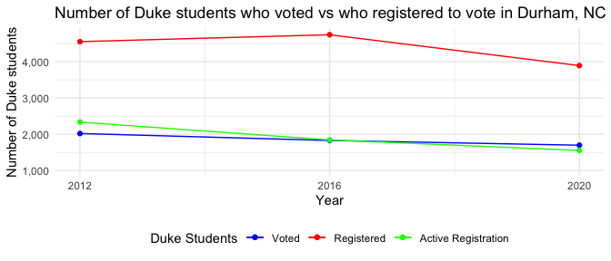
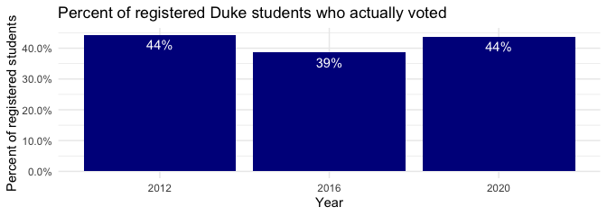

To: Tyler Dukes

From: Margaret Reed, Caitlin Dougherty

Date: April 15th, 2022

Re: How has Duke student voting changed over time?

### Intro

Many of the ‘bluest’ cities and towns in America house a variety of
universities and colleges. We began our data analysis investigation
interested in investigating the impact Duke and other university
students have on the elections of Durham and North Carolina. After
parsing and exploring the data, we came away with a couple of questions
to further pursue. How have NC Duke student registration numbers changed
over time? How does this compare with the number of Dukes students who
ended up voting in North Carolina? Likewise, we were also interested in
looking into how political party affiliations and voting habits have
changed over time.

### Methodology

To begin, we needed data. We ended up using NC voter registration data
and NC voter history data. However, nowhere in our data sets was there a
column for Duke Student: Y/N. Therefore, we needed to find some sort of
heuristic to approximate what constitutes a Duke student using the data
we had available. After some trial and error, we ended up classifying
Duke students as those whose mailing addresses were located on Duke’s
campus. The specific methodology is as follows:

  - The mailing address must specify a voter lives in a dorm named:
    “Bassett”, “Epworth”, “Few Quad”, “Gilbert Addoms”, “Giles”,
    “Jarvis”, “Maxwell”, “Mirecourt”, “Pegram”, “Randolph”, “Randolph
    Hall”, “Round Table”, “Southgate”, “Wayne Manor”, “Wilson”, or
    “Wannamaker”.

  - Otherwise, the street name must be one of the following: “Duke
    University West Campus”, “Duke University East Campus”, “Towerview”,
    “Alexander”, or “Yearby”.

  - Finally, we also looked at two special cases: Duke-owned apartment
    300 Swift, and the few outliers that were located on Campus Drive.

When considering students who were registered to vote, we imposed a 5
year limit after which we no longer considered a registered individual a
student.

All of these decisions were driven by an exploration of the data and
looking at where high numbers of young people were concentrated near
Duke’s campus. Because our analysis only looks at registered voters in
Durham county, NC- we are not considering any of the students who may
have decided to vote in their home county or state. After classifying
who the Duke students were (within our methodology), we were ready to
begin our analysis.

### Analysis

<!-- -->

First, we looked into how many Duke students actively registered to vote
during the presidential election years. Interestingly, it seems Duke
students were the most motivated to register to vote in the 2012
election. It would be interesting to investigate further whether this is
true- and dig into why, or if this can be attributed to the methodology
we used to classify Duke students in 2012. Next, we looked at how many
Duke students were registered to vote- whether that be because they
actively registered or because a previous voter registration carried
over. This value increased steadily over time, likely due to students
forgetting to cancel their registration despite moving out of the
county/state.

<!-- -->

We also graphed the proportion of registered Duke students who voted in
Durham, NC. Likewise, the number of those who took advantage of their
voter registration status and voted decreased from 2012 to 2020.

### Conclusion:

Based on our analysis from 2012 to 2020, Duke students are both
registering to vote and voting less in presidential elections in Durham
county, NC. Perhaps they are less motivated by the candidate or have
less access to the polls. Alternatively, it is also possible that over
time, more Duke students are choosing to vote in their home state/county
rather than using their Duke residence. This might be because they feel
they will have more of an impact in other states or because they don’t
want to change their registration.

### Next Steps:

Regardless, with midterm elections coming up it is important for all the
Duke students who are interested, to feel comfortable and empowered to
register and then vote. Duke provides resources for students and faculty
through the site [Duke Votes](https://vote.duke.edu/). According to
their homepage, those who have questions can contact Duke Votes chair,
Daisy Lane, at <margarita.lane@duke.edu>. They provide several
[resources](https://vote.duke.edu/resources/) for those looking to get
involved and/or register to vote.

If we had more time, we would like to further hone our methodology for
determining who is a Duke student and investigate what caused the surge
in registrations and voting in 2012.

### Further analysis

We also looked into our secondary question of how Duke students’
political party affiliations changed over time.

<!-- -->

It seems that the number of Duke students registered as Democrats
increased over time and the number of Duke students registered as
unaffiliated decreased.

The same pattern can be seen in this filled bar chart.

<!-- -->

Additionally we looked at voting method over time:

<!-- -->
